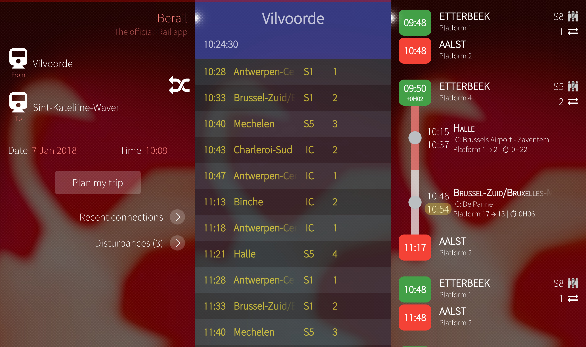

<h1 align="center">
   
  
   
   
  BeRail
   
   
</h1>

BeRail is a Sailfish OS application to plan your journeys on the Belgian railway.
It uses the iRail API as source of information and is part of the [iRail project](https://github.com/irail).

BeRail is available in the official Jolla Store and on [Openrepos.net](https://openrepos.net/content/minitreintje/berail).

## Features
- Trip planner
- List of all trains that departure from a certain station in NMBS/SNCB old style
- Switch easy between departure and arrival station with just one click
- Integrated disturbances monitor for delays and interruptions
- Follow the trip of a train in real time
- Remember your favourite stations
- Quick access to your recent connections
- iRail occupancies shown with every connection, train, ...
- Simple beautiful Silica UI based on QML
- C++ backend based on [Qt5](https://www.qt.io)

# Contributions
BeRail is an open source project licensed under the GPLv3 license and is open for contributions.

## How to contribute
- Fork this repo
- Add your changes
- Test if everything works
- Make a Pull request

## Architecture overview
A class diagram for the C++ back end and the QML UI is available in this repo under the folder '[docs](https://github.com/iRail/harbour-berail/tree/develop/docs)'.

## Roadmap
Take a look at the BeRail Github issues, milestones and projects.

## Translations
You can translate BeRail using the Transifex translation service.
In case the language isn't available, you can always request it and I will add it as soon as possible.

https://www.transifex.com/dylanvanassche/harbour-berail/

The translations are automatically updated on Transifex when a Pull Request has been merged in this repo.

## Powered by
- [Qt5](https://www.qt.io)
- [Transifex](https://www.transifex.com)
- [Sailfish OS](https://www.sailfishos.org)
- [iRail API](https://api.irail.be)
- [BeRail icon by Timo Könnecke](https://twitter.com/eLtMosen)

## Screenshots

